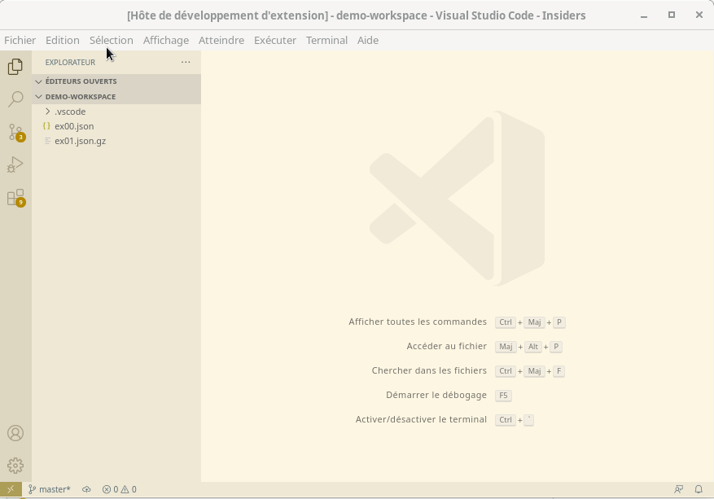

# vscode extension pipe-to-untitled

## Demo

Given a configuration [`.vscode/settings.json`](./src/test/demo-workspace/.vscode/settings.json) as below:

```json
{
  "hi-ogawa.pipe-to-untitled.commands": [
    {
      "name": "json prettify",
      "command": "jq"
    },
    {
      "name": "gzip decompress",
      "command": "gunzip -c -"
    }
  ]
}
```

here is a demo screencast:



## Development

```sh
npm install
npm run build -- -w
npm run prettier
npm run test
cp -r .vscode-example/. .vscode  # then hit F5 to open src/test/demo-workspace

# Publish to marketplace
npm install -g vsce
npm run build
npx vsce package  # then upload to https://marketplace.visualstudio.com/manage/publishers/hi-ogawa
```
